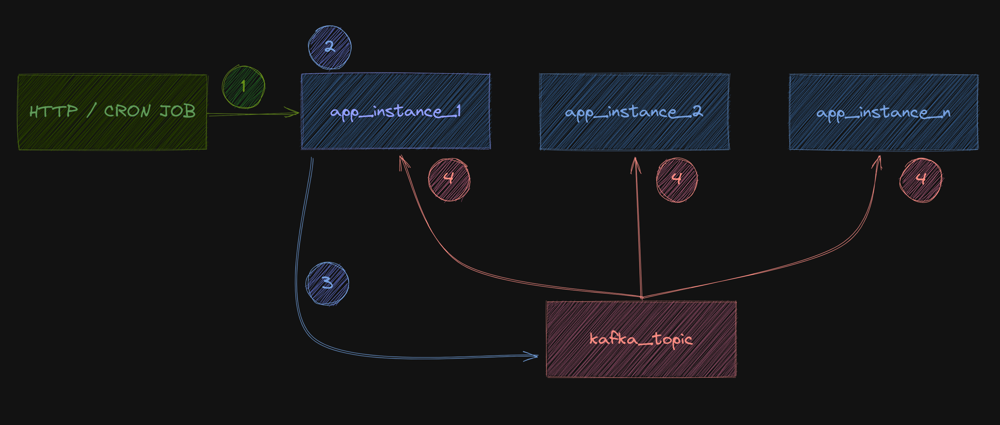

# kafka_parallel_processing_java

## What's the idea here?

Well... glad you asked! It's a simple demo project about using Kafka to increase parallel processing. When we want to increase the throughput of a process we can do it in a lot of ways. One common, and relative quick and easy way, is to add more instances of a service (be it a monolith or a microsservice).

**But then... how do we make sure the load is divided among every instance?** There are several ways of doing that, be it an orchestrator calling a Gateway/Load Balancer or the same service calling itself and severel other ways people smarter than me know how to do. One of the many ways of doing that is using Kafka messages!

Kafka is one of the many event streaming tools out there. It's one of the more common and robust ones. It has some caveats and it's a weird first setup but after that it's smooth sailing all the way!

### Ok... but how are we doing it?

Think of it this way... imanage you have a massive dataset to process. Be it a JSON from an HTTP request or a batch process in a cron job, it's a pesky O(n) process and you need to increase the throughput of it.

It doesn't matter who started the job, what matters is how many instances you dstribute that job.

_Here's a **very** simple diagram:_

&nbsp;

    

&nbsp;

So... here is how it works:

- First, one of our instances gets called to start a given task (1). It's first job is to gather the data and start doing basic transformations, and gathering info to start the hard lifting (2). This is an overall light tastk and easily done by one instance.
- Then, everytime we have some data to actually start the difficult job we start posting it (3). We do it one message at a time. Ideally as little data we can post (a simple object, for example). The idea is to produce a lot of small messages so we can start a lot of these process in parallel.
- After that, our instances start reading theses messages (4) and start processing each and every message. In case one of our instances dies that message is then read by another instances and so on and so forth.

Now... this is a really small dataset and this setup is completely overkill but it shows how it can scale in gigantic datasets where time might be a constraint.
